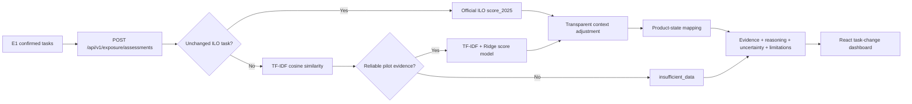

# Epic 2 technical report: understand how AI may change my tasks

> Date: 3 September 2026
>
> Team: FIT5120 Team 11 - United6
>
> Epic owner: Kuan Loong Lee
>
> Iteration: Iteration 1
>
> Implementation branch: `codex/e2-trained-model`
>
> Baseline commit: `3801a0a`
>
> Status: trained-model upgrade implemented and verified locally; staging deployment pending

## Important limitations

- The trained-model upgrade has not yet been verified against the staging Neon database or Vercel staging deployment.
- Product-state thresholds and workplace-context adjustments are transparent product rules, not learned model parameters.
- The current product pilot covers three retail occupation codes. Offline training uses a broader ILO task dataset.
- The robustness and gender-wording checks are regression probes, not a complete fairness audit.
- The model supports decision-making and exploration. It does not predict job replacement, personal readiness, hiring, or employment outcomes.

## Executive summary

Epic 2 helps a working woman understand how each task she confirmed in Epic 1 may be affected by AI. The implementation preserves official ILO task scores for unchanged reference tasks and uses a trained scikit-learn TF-IDF and Ridge regression model for edited or user-added task wording. It retrieves nearby ILO tasks as supporting evidence, applies user-provided workplace context through transparent rules, and returns one of four possible transformation states or `insufficient_data` when evidence is weak.

The model was trained on 3,265 labelled ILO task rows across 427 ISCO occupation groups. Five-fold grouped cross-validation produced MAE `0.0692`, RMSE `0.0926`, R-squared `0.6882`, and macro-F1 `0.5385`. The trained model materially outperformed the mean-score baseline MAE of `0.1395`. The API and UI expose the model version, evidence method, reasoning, confidence, uncertainty, limitations, and source for review.

## Problem and scope

### User problem

Christine can see general claims that AI will change jobs, but those claims do not explain what may happen to the individual tasks she performs. A job-level score alone may increase anxiety and can hide meaningful differences between routine processing, information use, human interaction, judgement, and responsibility.

### Epic 2 objective

For every task confirmed in Epic 1, Epic 2 must:

1. suggest `ai_assisted`, `partly_automated`, `reshaped`, `human_led`, or `insufficient_data`;
2. use task-level evidence rather than presenting occupation-level exposure as task certainty;
3. incorporate available workplace context;
4. explain the evidence, reasoning, uncertainty, and limitations; and
5. refresh results after the user changes task wording or context.

### Out of scope

- Predicting whether Christine will lose her job
- Certifying skills or professional readiness
- Recommending vacancies or guaranteeing employment
- Learning workplace-context weights without labelled context examples
- Using an LLM as the primary classifier
- GPU training when the lightweight CPU model meets the current latency and model-size requirements

## System architecture



### Runtime decision path

| Task condition | Score source | Evidence layer | Result |
|---|---|---|---|
| Unchanged task with matching ILO task ID and wording | Official `score_2025` | `exact` | Official score plus context adjustment |
| Edited or user-added task with sufficient similarity | Trained TF-IDF + Ridge model | `nlp` | Predicted score plus nearest ILO evidence and context adjustment |
| No reliable task-text match | None | `insufficient_data` | Evidence gap; no forced prediction |
| Occupation has no checked reference tasks | None | `insufficient_data` | Missing MASCO-to-ISCO correspondence stated explicitly |

## Data contract

### Training data

| Attribute | Value |
|---|---|
| File | `data/raw/ilo_task_score_raw.csv` |
| Entity grain | One ILO task within one ISCO-08 occupation |
| Model input | English `task_text` |
| Regression label | Continuous `score_2025` |
| Valid rows | 3,265 |
| ISCO groups | 427 |
| Dataset SHA-256 | `46940a80d525ff4635389e9480c8fcdcd53180a9548434ac398dd806a73f6f72` |
| Sensitive attributes used | None |

The model does not use a random row split. Validation groups rows by `isco_08`, preventing tasks from the same occupation appearing in both training and validation folds.

### Online request

```json
{
  "occupation_code": "5222",
  "confirmed_tasks": [
    {
      "task_id": "task-123",
      "task_text": "Coach sales staff through difficult customer cases",
      "context": {
        "routine_processing_level": null,
        "information_use_level": null,
        "human_interaction_level": null,
        "judgement_level": null,
        "responsibility_level": null,
        "time_spent": null
      }
    }
  ]
}
```

### Online response

```json
{
  "assessments": [
    {
      "task_id": "task-123",
      "suggested_state": "ai_assisted",
      "match_layer": "nlp",
      "baseline_score": 0.3362,
      "adjusted_score": 0.3362,
      "confidence": 0.5481,
      "model_version": "epic2-tfidf-ridge-v1",
      "model_type": "scikit_learn_tfidf_ridge_regression",
      "source_name": "Gmyrek et al. 2025 - ILO Working Paper 140",
      "reasoning": "The trained model predicted 0.34 and the closest ILO task matched with similarity 0.55.",
      "uncertainty": "Moderate uncertainty because semantic similarity is not a verified one-to-one match and optional context is missing.",
      "limitations": "Possible task transformation, not a prediction of job replacement.",
      "missing_data_status": "partial_context",
      "matched_reference_tasks": [
        {
          "ilo_task_id": "2",
          "task_text": "Instructing staff on sales procedures, including how to handle difficult or complex cases;",
          "score_2025": 0.365,
          "similarity": 0.5481,
          "source_method": "predicted"
        }
      ]
    }
  ]
}
```

The Pydantic request contract limits batches to 50 confirmed tasks and validates occupation codes and task-text length before inference.

## Model design

### Feature representation

The model uses scikit-learn `TfidfVectorizer` with:

- lowercase normalization;
- English stop-word removal;
- word unigrams and bigrams;
- `min_df=2`;
- `max_df=0.98`; and
- sublinear term frequency.

These settings preserve understandable word and phrase evidence while reducing very rare and overly common terms.

### Prediction model

`Ridge(alpha=1.0)` predicts the continuous ILO exposure score. Ridge regression was selected because:

- the source label is continuous;
- the sparse TF-IDF feature space benefits from regularisation;
- training and CPU inference are fast;
- the fitted pipeline is small enough to bundle with the FastAPI service; and
- the approach is more explainable and reproducible than introducing an LLM or neural model without evidence that it improves the product.

### Evidence retrieval

The trained vectorizer also transforms the pilot reference tasks. Cosine similarity ranks those tasks and provides the nearest evidence shown in the UI. Retrieval and score prediction have separate responsibilities:

- Ridge regression predicts the score.
- Cosine similarity supplies supporting task evidence and an abstention signal.

### Abstention

`insufficient_data` is not a fifth trained class. It is a product safeguard used when:

- the occupation has no checked task evidence; or
- the closest reference-task similarity is below the pilot threshold.

This prevents unrelated or extremely short tasks from receiving an unsupported confident classification.

### Workplace context

Context adjustments are applied after model prediction. Routine processing and information use can increase the score; human interaction, judgement, and shared or lead responsibility can reduce it. These weights are visible rules and are described in the result reasoning.

They must not be presented as learned parameters because the ILO training file does not contain labelled workplace-context values. Learning these weights requires a separate, reviewed context-labelled dataset.

## Training and evaluation

### Reproduction

```bash
backend/.venv/bin/python backend/ml/train_epic2_task_exposure_model.py
```

The command:

1. validates the required task text, score, and ISCO group columns;
2. calculates grouped five-fold validation predictions;
3. compares the model with the mean-score baseline;
4. enforces MAE and macro-F1 promotion gates;
5. runs formatting and gender-wording regression probes;
6. fits the final pipeline on all valid rows; and
7. writes the versioned artifact and JSON metrics.

### Performance

| Metric | Trained model | Mean-score baseline | Interpretation |
|---|---:|---:|---|
| Mean absolute error | 0.0692 | 0.1395 | Average score error is approximately halved |
| Root mean squared error | 0.0926 | 0.1659 | Large errors are reduced |
| R-squared | 0.6882 | - | Text explains a substantial portion of score variance |
| Macro-F1 | 0.5385 | - | Moderate four-state boundary performance; further error analysis remains necessary |

Promotion fails closed when model MAE does not beat the baseline or grouped macro-F1 is below `0.45`.

### Robustness and bias probes

| Probe | Maximum score difference | Guardrail |
|---|---:|---:|
| Case and punctuation formatting | 0.0000 | Regression evidence only |
| Otherwise identical `woman` versus `man` wording | 0.0000 | Must remain at or below 0.02 |

The probes contain three representative task descriptions. They demonstrate deterministic regression coverage but do not establish comprehensive fairness across occupation, language, age, ethnicity, disability, or workplace setting.

## Human-centric AI safeguards

| Safeguard | Implementation |
|---|---|
| User control | Only tasks confirmed through the Epic 1 flow are assessed |
| Correction | Editing task wording or context invalidates the saved analysis and triggers reassessment |
| Evidence | Exact or nearest ILO task evidence is shown |
| Transparency | Model type and version are returned by the API and displayed in the UI |
| Uncertainty | Exact, NLP, partial-context, and missing-data uncertainty are distinguished |
| Abstention | Weak evidence returns `insufficient_data` |
| Limitation language | Results explicitly reject job-loss, readiness, certification, and employment guarantees |
| Privacy | Task text and optional context are used for the requested assessment; demographic attributes are not model features |

## Acceptance-criteria traceability

| Acceptance criterion | Implementation evidence | Current verification state |
|---|---|---|
| AC 2.1.1 - Five supported states | Backend schema, trained score mapping, and abstention path | Automated tests pass; deployed smoke test pending |
| AC 2.1.2 - Possible transformation, not replacement | UI explanation and limitations text | Automated response checks pass |
| AC 2.1.3 - No unconfirmed task assessment | Existing profile gate and empty-task controls | Existing flow retained |
| AC 2.2.1 - Use workplace context | Five context inputs and transparent adjustment | Automated context comparison passes |
| AC 2.2.2 - Correction refreshes result | Saved analysis is invalidated after edits | Existing flow retained; staging smoke test pending |
| AC 2.2.3 - Do not present occupation evidence as task certainty | Exact, trained NLP, and abstention layers are separated | Automated tests pass |
| AC 2.3.1 - Show source, signal, context, uncertainty, and limitations | Response schema and expandable UI evidence panel | Build and API tests pass |
| AC 2.3.2 - State missing MASCO-to-ISCO correspondence | Explicit missing-correspondence reasoning | Automated insufficient-data test passes |
| AC 2.3.3 - Show evidence gaps and limited confidence | Similarity threshold, `missing_data_status`, and confidence | Automated NLP and unrelated-task tests pass |

Epic 2 must remain in progress until the trained artifact is committed, deployed to staging, and the full browser flow is repeated against the staging database.

## MAI expectations alignment

| MAI expectation | Epic 2 evidence |
|---|---|
| Predictive analytics | Trained Ridge regression predicts continuous task exposure scores |
| Natural language processing | TF-IDF word and phrase features plus cosine task retrieval |
| Human-centric AI | User correction, source evidence, uncertainty, limitations, and abstention |
| Open-source ML tools | scikit-learn 1.9.0 and joblib |
| Model evaluation | Grouped MAE, RMSE, R-squared, macro-F1, baseline comparison, and promotion gates |
| Robustness and bias | Formatting and gender-wording regression probes with documented limitations |
| Web application integration | Versioned model served through FastAPI and consumed by React |
| Research problem and dataset | Task-level AI transformation using ILO task evidence and MASCO-to-ISCO mapping |
| GPU training | Not used; the CPU model is sufficient for the current dataset and artifact size |
| Mainstream cloud ML API | Not used; the versioned model is self-hosted in the existing Vercel backend service |

## Verification evidence

### E-001 - Training dataset snapshot

- Source: `data/raw/ilo_task_score_raw.csv`
- SHA-256: `46940a80d525ff4635389e9480c8fcdcd53180a9548434ac398dd806a73f6f72`
- Rows: 3,265
- Groups: 427
- Reproduction: `backend/.venv/bin/python backend/ml/train_epic2_task_exposure_model.py`

### E-002 - Model artifact and metrics

- Artifact: `backend/app/model_artifacts/epic2_task_exposure_tfidf_ridge_v1.joblib`
- Artifact SHA-256: `9e8d862eeafe1d3ab253a10adbee895e5a666cc51fa508dc580dcf8e7f73e429`
- Metrics: `backend/app/model_artifacts/epic2_task_exposure_tfidf_ridge_v1.metrics.json`
- Metrics SHA-256: `f7c016c7788823985cc1ce9f1114c36644661fb68878786850e135805a5ab784`

The artifact hashes above identify the reviewed training run. Regenerating the artifact records a new training timestamp and therefore produces a new artifact and metrics-file hash, while the dataset hash and deterministic validation metrics remain stable.

### E-003 - Automated backend verification

```bash
backend/.venv/bin/pytest backend/tests -q
```

Observed result: 16 tests passed. Warnings concern existing FastAPI/Starlette deprecations and do not represent test failures.

### E-004 - Frontend verification

```bash
cd frontend
npm run build
npm run lint
```

Observed result: the production build completed and lint returned zero errors. Existing React-hook and fast-refresh warnings remain recorded for later cleanup.

## Findings

### F-001 - Trained text model materially improves the baseline

- Status: validated
- Evidence: E-001, E-002, E-003
- Confidence: high
- Finding: grouped validation MAE improves from `0.1395` to `0.0692`, and grouped R-squared reaches `0.6882`.
- Path forward: retain the trained model for edited/user-added tasks and monitor deployed prediction and latency distributions.

### F-002 - Data leakage is reduced through occupation-grouped validation

- Status: validated
- Evidence: E-001, E-002
- Confidence: high
- Finding: `GroupKFold` isolates ISCO groups across folds, providing a stricter estimate than a random task-row split.
- Path forward: preserve `isco_08` grouping for every retraining run.

### F-003 - The model is suitable as decision support, not a precise forecast

- Status: validated
- Evidence: E-002, E-003, E-004
- Confidence: high
- Finding: macro-F1 `0.5385` indicates meaningful but imperfect state-boundary performance. The UI must retain evidence, uncertainty, correction, and abstention.
- Path forward: perform error analysis around the `0.25`, `0.40`, and `0.55` boundaries before considering threshold changes.

## Evidence-to-user path

### P-001 - Confirmed task to explainable result

1. Epic 1 supplies a user-confirmed task and optional context - evidence: E-003.
2. The API checks for exact ILO task evidence - evidence: E-001.
3. Edited/user-added text is transformed by the versioned TF-IDF pipeline - evidence: E-002.
4. Ridge regression predicts the baseline score and nearest-task retrieval supplies evidence - evidence: E-002.
5. Transparent context rules adjust the score, or weak evidence triggers abstention - evidence: E-003.
6. React displays state, model version, source, reasoning, uncertainty, limitations, and confidence - evidence: E-004.

Residual risks are English-first training data, moderate class-boundary performance, limited fairness probes, pilot occupation coverage, and unverified staging latency.

## Deployment, monitoring, and rollback

### Packaging

- Model artifact size: approximately 101 KB
- Artifact location: inside `backend/app/model_artifacts/`, so it is bundled with the Vercel backend service
- Runtime dependency: `scikit-learn==1.9.0`
- The artifact loader accepts only the fixed repository path and validates the expected version and pipeline type before inference

### Deployment checks

Before moving Epic 2 to Done:

1. commit the trained artifact, metrics, model card, code, and dependency changes;
2. push the branch and merge it into `staging` through the agreed Git workflow;
3. confirm the Vercel backend can import scikit-learn and load the artifact;
4. execute exact, NLP, context-refresh, missing-correspondence, and unrelated-task browser cases;
5. record p50 and p95 API latency for representative batches; and
6. update LeanKit with the commit, deployed URL, metrics, screenshots, and acceptance-check evidence.

### Monitoring

The first operational metrics should be:

- endpoint availability and error rate;
- p50 and p95 assessment latency;
- exact, NLP, and `insufficient_data` result proportions;
- average and distribution of prediction confidence;
- missing-context rate; and
- model version returned by every NLP result.

### Rollback

Rollback does not require retraining. Restore the prior backend commit and artifact. Exact ILO evidence remains the preferred path for unchanged tasks, while `insufficient_data` remains the safe fallback when trained-model evidence cannot be established.

## Team responsibilities

| Member | E2 responsibility |
|---|---|
| Kuan Loong Lee | Epic owner; model integration, API contract, serving path, and technical report |
| Yile Yang | Dataset review, labelled paraphrase evaluation, and threshold calibration support |
| Ruiduo Zhang | Explanation wording, uncertainty presentation, and UI review |
| Yuanqing Li | Acceptance testing, robustness cases, deployment evidence, and regression tracking |

## References

- Gmyrek et al. (2025), *Generative AI and jobs: A refined global index of occupational exposure*, ILO Working Paper 140.
- Ministry of Human Resources Malaysia (2020), *Malaysia Standard Classification of Occupations 2020*.
- Monash University, *MAI Expectations 2026 S2*.
- `docs/model_cards/epic2_task_exposure_tfidf_ridge_v1.md`.
- `docs/iteration1_data_management.md`.
- `docs/iteration1_erd.md`.
