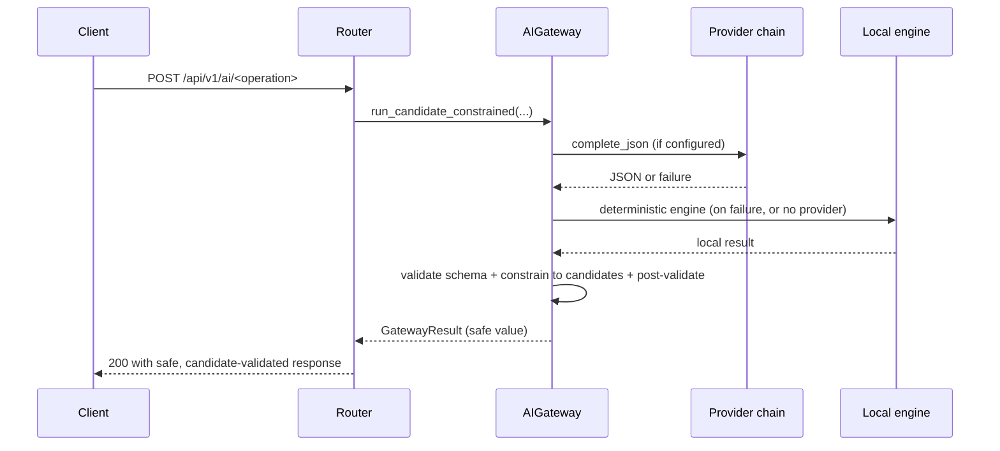

# 02 — Candidate-Constrained AI APIs (`/ai/*`)

**Sources:** `backend/app/routers/ai.py`, `backend/app/services/ai_matching.py`,
`backend/app/services/skill_matching.py`, `backend/app/services/occupation_ai.py`,
`backend/app/schemas/{ai_matching,skill_matching,occupation_ai}.py`

**Tests:** `backend/tests/test_ai_api_contract.py`, `test_ai_task_match.py`,
`test_skill_match.py`, `test_occupation_ai.py`

## 1. The core contract

All four endpoints share one design rule that makes the AI layer safe for an
ethics-sensitive career tool:

> **The request's candidate list is the only vocabulary the response may use.**

Whatever path produced an answer — the deterministic engine or an LLM — the
following invariants are enforced before the response leaves the gateway:

| Invariant | Mechanism |
|-----------|-----------|
| Only supplied identifiers may appear | `_constrain_result` in the gateway + `enforce_task_match_contract` / candidate filtering per endpoint |
| Identifiers are matched byte-for-byte | No case-folding, trimming or fuzzy ID matching; unknown ids are cleared or dropped |
| Titles are re-sourced from the request | The gateway overwrites item titles with the supplied candidate's title |
| Evidence must exist in the input | Skill evidence phrases must appear verbatim in the task text |
| Confidence is bounded | Clamped to `[0.0, 1.0]`, NaN/inf → `0.0` |
| Claims are filtered | A regex (`_UNSAFE_CLAIM_PATTERN`) replaces reasons that predict job loss/timelines with a neutral default |
| Every response confirms | `needs_user_confirmation: true` |
| Failures never 500 | Deterministic engine result → validated static fallback (see §6) |

## 2. Shared request flow



`prefer_local_on_provider_failure=True` on all four routes: when the provider
chain exhausts its attempts, the deterministic engine is used *before* the
static fallback, so a working LLM outage still returns useful output.

## 3. `POST /api/v1/ai/task-match`

Maps a free-text user task onto **one of the supplied ILO/standard task
candidates** for a given 4-digit occupation code.

**Request** (`TaskMatchRequest`): `occupation_code` (`^\d{4}$`),
`user_task` (1–2000 chars), `candidates[]` (`id` ≤256, `text` ≤2000, ≤100 items).

**Response** (`TaskMatchResponse`): `candidate_id` (may be `''`),
`confidence`, `matched_concepts[]`, `unmatched_concepts[]` (≤50 each),
`reason`, `clarifying_question`, `needs_user_confirmation`.

**Deterministic engine** — `DeterministicTaskMatchProvider` + `ai_matching.py`:

1. Tokenisation: case-folded word tokens, a small *conservative* stop-word
   list (so domain words survive), light canonicalisation (`...ies → y`,
   `...ses`, trailing `s`).
2. Concept lists preserve the user's original display tokens (for evidence)
   while comparing canonical forms; duplicates removed, bounded to 50.
3. Confidence blend per candidate:
   `0.65 × token-F1 + 0.20 × precision + 0.15 × SequenceMatcher ratio`
   — precision-weighted because a concise user description can legitimately be
   a subset of a longer reference task. A single shared token in a longer
   description is discounted (× 0.65).
4. `rank_task_candidates` sorts descending; Python's stable sort preserves the
   caller's order on ties.
5. Floor `MINIMUM_TASK_MATCH_CONFIDENCE = 0.5`: below it, no candidate is
   selected (`candidate_id: ''`) and a clarifying question is returned instead
   of a forced match.
6. `enforce_task_match_contract` re-applies the allowlist and floors on any
   provider output, and the route applies it **twice** (inside the local
   callback and on the final result) — defence in depth.

## 4. `POST /api/v1/ai/skill-match`

Suggests **at most two WEF skills** for a task, each with verbatim evidence.

**Request** (`SkillMatchRequest`): `task_text`, `candidates[]` (`id` int,
`skill` ≤256, ≤100 items) — typically the WEF skill table rows relevant to the
occupation.

**Response** (`SkillMatchResponse`): `skills[]` (≤2) with
`wef_skill_id`, `confidence`, `evidence_phrases[]` (≤20),
`needs_user_confirmation`.

**Deterministic engine** — `skill_matching.py`:

- A small auditable rule table (`SKILL_RULES`) maps *observable task phrases*
  to skill ids with fixed confidences (0.84–0.90), e.g. `customer service →
  skill 10 (0.90)`, `instructing staff → skill 16 (0.88)`.
- **Rule ids are hints, not output**: a rule fires only if the same id is in
  the caller's candidate list — the candidate allowlist always wins.
- Evidence is the *exact source substring* found in the task text
  (case-insensitive match, original casing preserved, deduplicated).
- `MAX_SKILL_MATCHES = 2`, `MINIMUM_SKILL_MATCH_CONFIDENCE = 0.50`.

**Post-validation (LLM path):** `_retain_task_evidence` (in the router) drops
any provider item whose evidence phrases are not all present verbatim in the
task text and caps the list at two — an LLM cannot smuggle in unsupported
skill suggestions.

## 5. Occupation endpoints

Both are "exploration only" tools: they rerank **only the caller-supplied
occupations** (the backend never queries the occupation database here).

### 5.1 `POST /api/v1/ai/occupation-suggestions`

**Request**: `user_description` (≤10000), `extracted`
(`actions`/`objects`/`scope`/`industry` signal lists, ≤100 each),
`candidates[]` (`code`, `title`, `description`, ≤500).

**Deterministic scoring** (`_score`, floor `SUGGESTION_CONFIDENCE_FLOOR = 0.30`,
top `MAX_RESULTS = 5`):

```
score = 0.35 × query-coverage + 0.35 × candidate-coverage
      + 0.15 × title-coverage + 0.15 × detail-coverage
```

- Tokenisation normalises accents (NFKD) and applies a canonical-forms map.
- `evidence` strings are built **only from supplied terms** ("Shared supplied
  terms: …", "The supplied occupation title matches: …").
- `difference` states which user terms are absent from (or extra in) the
  candidate details — again from supplied values only.
- Below the floor, the response becomes `status: "clarifying"` with questions
  derived from missing `extracted` fields (activities / objects / scope /
  industry).

### 5.2 `POST /api/v1/ai/occupation-recommendations`

**Request**: `selected_occupation` (`occupation_code`, `title`),
`user_context` (str | list | dict, flattened for matching only),
`candidates[]` (`code`, `title`, `why_similar`).

**Deterministic scoring** (floor `RECOMMENDATION_CONFIDENCE_FLOOR = 0.28`):
`0.70 × lexical score + min(note_tokens / 10, 1.0) × 0.30` — a supplied
`why_similar` note can only *help* a candidate, never carry it alone.

**Evidence always starts with the disclaimer**
*"Exploration only; this is not hiring advice."* and quotes the supplied
similarity note. Below the floor → `clarifying` with guidance questions.

**Status field**: both responses are `status: "suggestions" | "clarifying"`;
the gateway additionally downgrades an empty `suggestions` list to
`clarifying` if the candidate constraint removed every item.

## 6. Degradation behaviour (identical contract on all four routes)

| Situation | Response |
|-----------|----------|
| No provider configured | Deterministic engine result |
| Provider fails after retries | Deterministic result (`used_fallback=True` in metadata) |
| Provider returns unusable output | Same as above (schema validation fails → local engine) |
| Local engine also failed (never observed) | Static validated fallback: empty selection + clarifying question |
| Cache hit | Previous validated result, instant |
| No candidate is reliable | Empty selection + clarifying question (a *first-class outcome*, not an error) |

No path produces a 5xx; the frontend hides AI blocks on the rare static
fallback (which carries no suggestions).

## 7. Frontend consumption

`frontend/src/services/aiService.ts` wraps all four endpoints:

| Endpoint | UI location |
|----------|-------------|
| `task-match` | Task editor → "Standard task check / Find closest standard task" |
| `skill-match` | Task details drawer → "Suggested skills" |
| `occupation-suggestions` / `occupation-recommendations` | Service is ready; page entry points not yet wired |

## 8. Verification

```bash
# Deterministic (no key needed):
curl -s -X POST http://127.0.0.1:8000/api/v1/ai/task-match \
  -H 'Content-Type: application/json' -d '{
    "occupation_code": "5222",
    "user_task": "I decide shift timetables and allocate staff to their duties",
    "candidates": [
      {"id": "5222-1", "text": "Planning and preparing work schedules and assigning staff to specific duties;"},
      {"id": "5222-2", "text": "Selling goods and services and managing stock levels;"}]}'
```

Contract tests to read first: `test_ai_api_contract.py` (allowlist, floors,
`needs_user_confirmation`, degradation) and the three engine suites.
