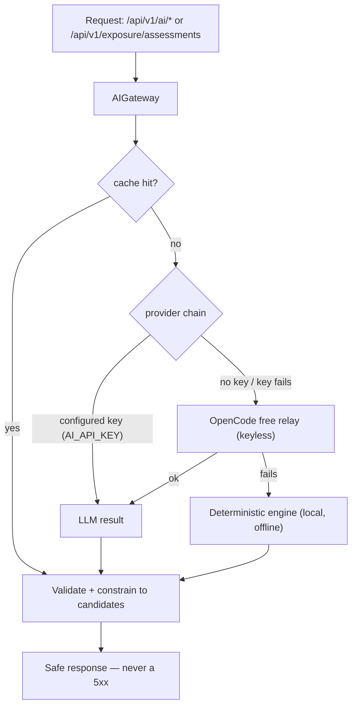

# Backend Feature Documentation — AI Services Layer

**Author:** Ruiduo Zhang (rzha0212)
**Scope:** backend features implemented on the `ruiduo` branch, merged into `iteration-2-zhangxu`
**Last updated:** 2026-09-10

This folder documents the backend work delivered for Iteration 2 of the AI-Wrevolusi
project: the optional LLM layer that sits on top of the existing deterministic
services, the four candidate-constrained `/ai/*` endpoints, and the exposure
assessment integration (AI task-match judge and score context). Each document
explains the technical architecture and the implementation approach, and points
to the exact source files so the behaviour can be verified in code.

## Documents

| # | File | Covers |
|---|------|--------|
| 0 | `README.md` | This index: feature map, architecture, quick verification |
| 1 | `01_ai_gateway_architecture.md` | AI gateway, provider abstraction, wire modes, fallback chain, resilience, configuration |
| 2 | `02_candidate_constrained_apis.md` | The four `/ai/*` endpoints: contracts, deterministic engines, LLM path, response shapes |
| 3 | `03_exposure_assessment_llm_layer.md` | Exposure integration: LLM judge layer, score context, bands, context adjustments |
| 4 | `04_testing_and_operations.md` | Test strategy, offline policy, operations runbook, extension guide |

Related documents already in `docs/`:

- `iteration2_backend_design.md` — Iteration 2 backend design summary
- `iteration2_ai_api_documentation.md` — API-level documentation
- `iteration2_integration_and_deployment.md` — integration and deployment guide
- `ai_api_contract.md` — the original AI API contract

## Feature summary

| Feature | Entry point | Primary implementation |
|---------|-------------|------------------------|
| Candidate-constrained task matching | `POST /api/v1/ai/task-match` | `backend/app/services/ai_matching.py`, `backend/app/routers/ai.py` |
| WEF skill matching | `POST /api/v1/ai/skill-match` | `backend/app/services/skill_matching.py` |
| Occupation suggestions | `POST /api/v1/ai/occupation-suggestions` | `backend/app/services/occupation_ai.py` |
| Occupation recommendations | `POST /api/v1/ai/occupation-recommendations` | `backend/app/services/occupation_ai.py` |
| AI gateway + provider abstraction | shared infrastructure | `backend/app/services/ai_gateway.py` |
| Provider priority chain with free relay fallback | shared infrastructure | `backend/app/services/ai_gateway.py` (`FallbackProvider`) |
| LLM task-match judge for exposure | `POST /api/v1/exposure/assessments` | `backend/app/services/ai_task_judge.py`, `backend/app/services/exposure.py` |
| Task score context (band / scale / explanation) | `POST /api/v1/exposure/assessments` | `backend/app/services/exposure.py`, `backend/app/schemas/exposure.py` |

## Architecture at a glance



The deterministic engines are always present and always correct-by-construction;
the LLM is an optional layer that can make the same endpoints smarter when a
provider is available, but its absence or failure never changes the API
contract and never blocks a request.

## Design principles shared by all features

1. **Candidate-constrained output.** The request's candidate list is the only
   vocabulary the response may use. Provider output is treated as untrusted:
   every identifier is validated against the candidates, and titles, evidence
   phrases and scores are re-sourced from the supplied data or dropped.
2. **Always-200 degradation.** Timeouts, HTTP errors, malformed JSON, unknown
   identifiers and missing credentials all resolve to a deterministic result,
   a validated local fallback, or a clarifying question — never a 500 and never
   a blocked UI flow.
3. **`needs_user_confirmation: true` everywhere.** Every AI-shaped response
   states that the result is a suggestion for the user to confirm or edit.
4. **No invented identifiers or numbers.** LLM output may only select from
   supplied MASCO codes / ILO task IDs / WEF skill IDs; scores always come from
   the ILO 2025 source data, never from the model.
5. **Offline-first testing.** The test suite pins the environment so no test
   can reach the network, and the fallback chain is disabled during tests.
6. **Ethics guardrails.** No unemployment timing, no job-replacement
   predictions, no subjective judgement of the user's work. Uncertain results
   are presented as *evidence gaps*, not negative conclusions.

## Quick verification

```bash
cd backend
.venv/Scripts/python.exe -m pytest -q     # 101 passed
.venv/Scripts/python.exe -m uvicorn app.main:app --port 8000
```

```bash
# Deterministic path works without any key:
curl -s -X POST http://127.0.0.1:8000/api/v1/ai/skill-match \
  -H 'Content-Type: application/json' \
  -d '{"task_text":"Managing a shop team and handling customer complaints",
       "candidates":[{"id":10,"skill":"Service orientation and customer service"},
                     {"id":16,"skill":"Instructing"}]}'
```

See `04_testing_and_operations.md` for the full runbook.

## Commit trail (branch `ruiduo`)

| Commit | Description |
|--------|-------------|
| `b610848` | feat: add candidate-constrained AI backend APIs |
| `de4f579` | fix: use deterministic occupation recommendation fallback |
| `7401097` | feat(ai): wire optional LLM provider, llm match layer and score context |
| `39bf3d6` | feat(ai): support the Responses API and keyless relays in the AI provider |
| `ba2e3d1` | feat(ai): prefer a configured key and fall back to the OpenCode relay |
| `d4c183a` | fix(exposure): smooth the score-context wording in reasoning and explanations |

## Scope boundaries

- The **exposure deterministic engine** (TF-IDF + cosine retrieval over the ILO
  reference tasks) was built earlier by a teammate (commit `3801a0a`). This
  work adds the optional LLM judge layer and the score-context fields on top of
  it; the documents describe that integration, not the original engine.
- **Data layers** (occupation / ILO / WEF reference data, database loading) and
  **auth/accounts** are other team modules and are out of scope here.
- The **`SKILL_LLM_*` configuration** used by the separate "learning
  directions" feature is an independent LLM setup; it does not use this
  gateway and is not affected by the fallback chain described here.
