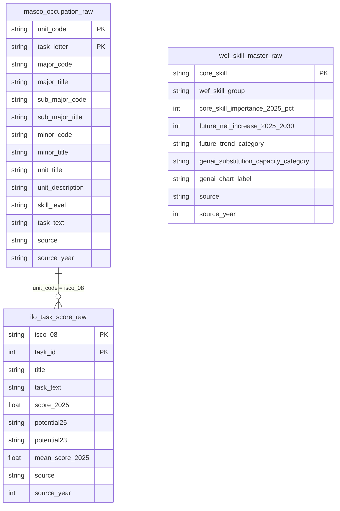
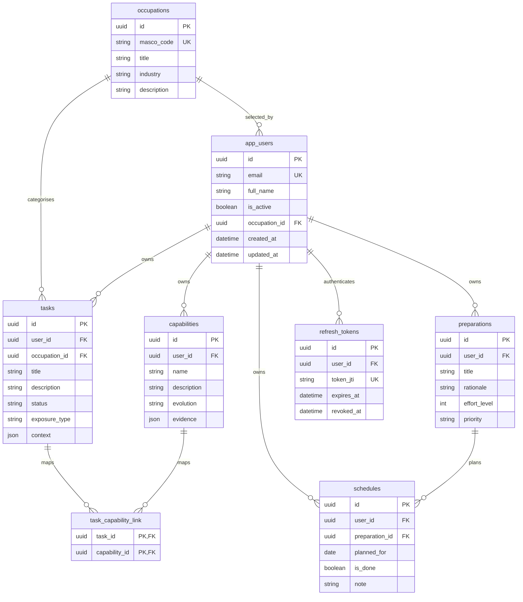

# Iteration 1 ERD (E1–E4)

Route this model follows:

```text
MASCO occupation (4-digit)
  → ILO tasks (unit_code = isco_08)          encoding join
  → user confirms / edits / adds tasks       add may use speech-to-text
  → ILO-linked task: exposure from ILO row   exact
     user-added or edited task: trained TF-IDF + Ridge score prediction,
       nearest-task evidence, then insufficient_data when no reliable match exists
  → each confirmed task → WEF core skills    NLP then AI (no encoding join)
  → E4 confirm / correct
```

Four layers:

- **Raw** (`data/raw/`): source row tables. Do not overwrite in the product.
- **Reference** (`data/reference/`): lookup tables imported from raw (`import_from_raw.py`). Refresh when raw changes.
- **Current user state**: occupation, edited tasks, and confirmed analysis are stored as browser JSON under `aiwrevolusi.userProfile`.
- **Backend business** (`backend/app/models/`): authenticated account, generic task, capability, preparation, and schedule tables in Neon.

WEF does **not** join to MASCO/ILO by 4-digit code.  
The current app does not persist WEF matcher output in a Neon crosswalk table.

ESCO is out. E5–E8 are not modelled. Pilot units: `5221`, `5222`, `5223`.

---

## Raw tables



MASCO `task_text` is kept for later alignment. **E1 starter tasks come from ILO.** Occupation-level `mean_score_2025` / `potential25` may show as E1 background only.

---

## Current backend business tables



`occupations` and `ref_occupations` are separate. The former is an ORM table using UUID keys; the latter is the Iteration 1 MASCO lookup using 4-digit codes. There is no automatic synchronization between them.

The Iteration 1 work-profile screens currently save the selected `ref_occupations.occupation_code`, edited tasks, and E2 results to browser `localStorage`, not to the backend business tables above. The older `users`, `work_profiles`, `profile_tasks`, `task_assessments`, `profile_wef_skills`, `wef_skill_task_links`, `skill_examples`, and `review_events` CSV/SQL definitions are legacy design sketches and are not used by current code.

The E2 pilot uses a versioned scikit-learn TF-IDF + Ridge artifact for edited/user-added task scores and does not use an LLM fallback; it exposes low-confidence text matches as `insufficient_data` instead.

### Status and matching values

| Current ORM field | Allowed values |
|---|---|
| `tasks.status` | `needs_review` / `confirmed` / `optional_context_missing` |
| `tasks.exposure_type` | `human_led` / `ai_assisted` / `partly_automated` / `reshaped` / `insufficient_data` |
| `capabilities.evolution` | `continue_to_be_useful` / `needs_strengthening` / `needs_updating` |
| `preparations.priority` | `high` / `medium` / `low` |

The richer E1 confirmation and review-event values remain browser-side until a reviewed Neon persistence model is implemented.

---

## Files

| Layer | Path |
|---|---|
| Raw | `data/raw/masco_occupation_raw.csv` |
| Raw | `data/raw/ilo_task_score_raw.csv` |
| Raw | `data/raw/wef_skill_master_raw.csv` |
| Reference | `data/reference/ref_occupations.csv` |
| Reference | `data/reference/ref_ilo_tasks.csv` |
| Reference | `data/reference/ref_wef_skills.csv` |
| Database | `db/schema.sql` |
| Database | `db/seed_reference.py` |
| Backend business schema | `backend/app/models/*.py` |
| Current E1 user state | `frontend/src/pages/WorkProfile/userProfile.ts` (`localStorage`) |
| Process | `docs/iteration1_data_management.md` |
| Legacy business sketches | `data/business/*.csv` |
