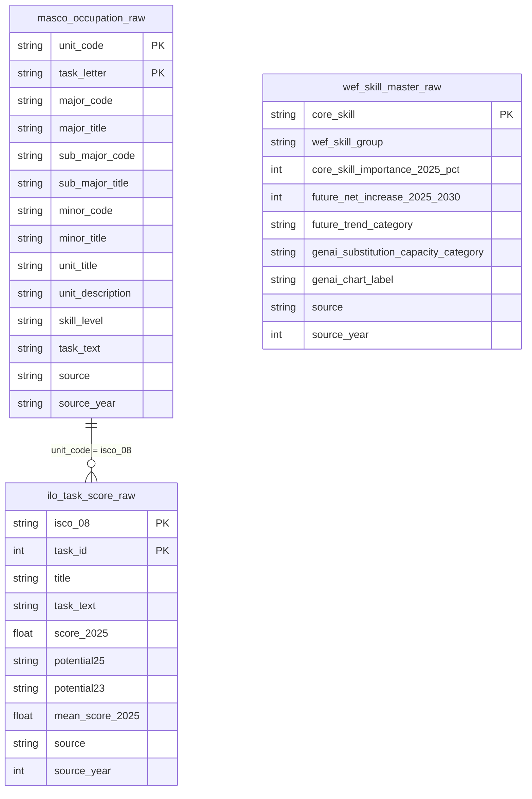
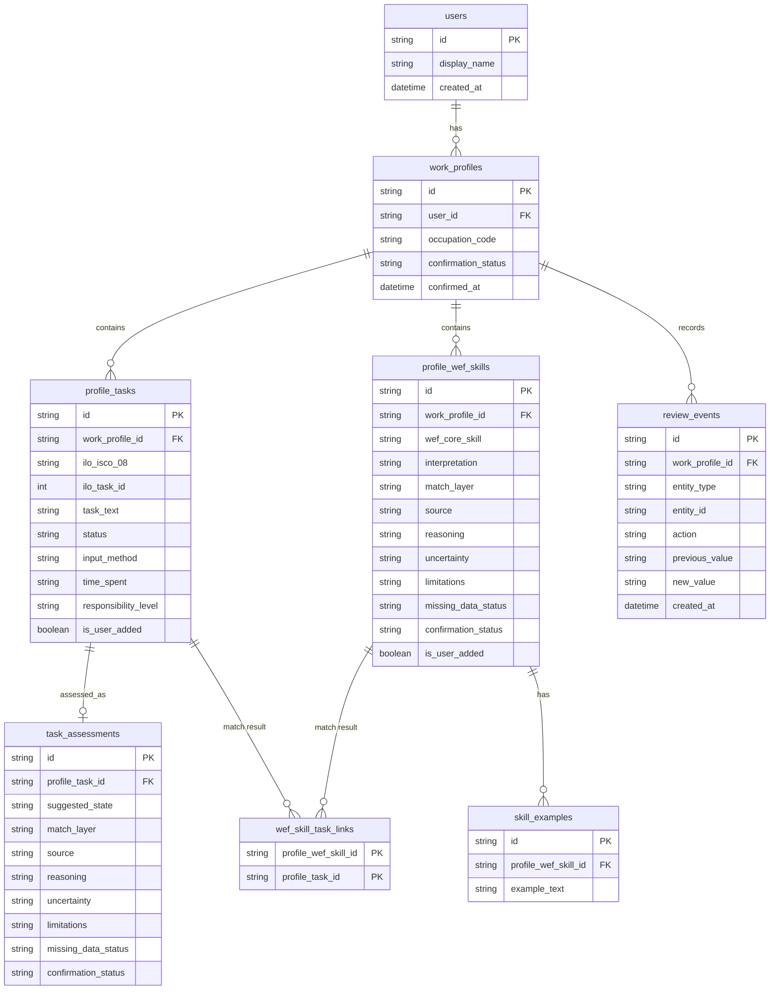

# Iteration 1 ERD (E1–E4)

Route this model follows:

```text
MASCO occupation (4-digit)
  → ILO tasks (unit_code = isco_08)          encoding join
  → user confirms / edits / adds tasks       add may use speech-to-text
  → ILO-linked task: exposure from ILO row   exact
     user-added task: NLP then AI exposure
  → each confirmed task → WEF core skills    NLP then AI (no encoding join)
  → E4 confirm / correct
```

Three layers:

- **Raw** (`data/raw/`): source row tables. Do not overwrite in the product.
- **Reference** (`data/reference/`): lookup tables imported from raw (`import_from_raw.py`). Refresh when raw changes.
- **Business** (`data/business/`): user profile and **match results**.  
  Speech-to-text is an input method (`profile_tasks.input_method`), not a table.

WEF does **not** join to MASCO/ILO by 4-digit code.  
`wef_skill_task_links` stores matcher output, not a source crosswalk.

ESCO is out. E5–E8 are not modelled. Pilot units: `5221`, `5222`, `5223`.

---

## Raw tables



MASCO `task_text` is kept for later alignment. **E1 starter tasks come from ILO.** Occupation-level `mean_score_2025` / `potential25` may show as E1 background only.

---

## Business tables



`work_profiles.occupation_code` is the MASCO/ILO 4-digit unit (e.g. `5222`). It is a **logical** reference to raw tables, not a database FK file.

`profile_wef_skills.wef_core_skill` is a **logical** reference to `wef_skill_master_raw.core_skill`. User-added skills may be free text with `is_user_added = true`.

`wef_skill_task_links` is written **after** NLP/AI. Empty `ilo_task_id` means a user-added task (no official ILO exposure row).

### Status and matching values

| Field | Allowed values |
|---|---|
| `work_profiles.confirmation_status` | `suggested` / `confirmed` / `corrected` |
| `profile_tasks.status` | `suggested` / `confirmed` / `edited` / `removed` |
| `profile_tasks.input_method` | `typed` / `speech` |
| `task_assessments.suggested_state` | `ai_assisted` / `partly_automated` / `reshaped` / `human_led` / `insufficient_data` |
| `match_layer` | `exact` / `nlp` / `llm` / `insufficient_data` |
| `profile_wef_skills.interpretation` | `continue_useful` / `need_strengthening` / `need_updating` |
| `review_events.entity_type` | `occupation` / `task` / `assessment` / `wef_skill` |
| `review_events.action` | `confirm` / `correct` / `remove` / `add` |

Unconfirmed tasks must not go to E2/E3. Later stages read **confirmed** values.

---

## Files

| Layer | Path |
|---|---|
| Raw | `data/raw/masco_occupation_raw.csv` |
| Raw | `data/raw/ilo_task_score_raw.csv` |
| Raw | `data/raw/wef_skill_master_raw.csv` |
| Reference | `data/reference/ref_occupations.csv` |
| Reference | `data/reference/ref_ilo_tasks.csv` |
| Reference | `data/reference/ref_wef_skills.csv` |
| Database | `db/schema.sql` |
| Database | `db/seed_reference.py` |
| Process | `docs/iteration1_data_management.md` |
| Business CSV sketches | `data/business/*.csv` |
